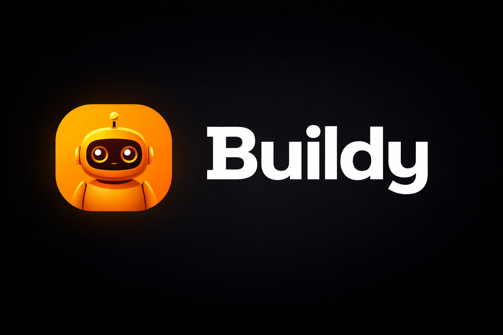

<p align="center">
  
</p>

<h2 align="center">Buildy</h2>
<p align="center">An AI builder companion that watches your Claude Code terminal and tells you what's happening — and what to type next.</p>

<p align="center">
  <a href="./LICENSE"></a>
  
  <a href="https://www.electronjs.org/"></a>
  
</p>

---

## Demo

<!-- TODO: replace with demo video URL -->
<p align="center">
  <a href="DEMO_VIDEO_URL_HERE">
    
    <br/>
    <strong>▶ Watch the 90-second demo</strong>
  </a>
</p>

---

## The problem

Claude Code is the best AI coding tool in the world. It was built by developers, for developers. When it works, it is astonishing — a machine that writes full features, tests, and infrastructure from a single sentence.

But the fastest-growing group of people using it have never written a line of code. They're founders, operators, and creators who were told "just use Claude Code." So they do. And then 400 lines of terminal output fly past, and they have absolutely no idea whether something brilliant just happened or whether their project is on fire.

They don't need to learn to code. They need a translator.

**Buildy is for them.**

---

## What Buildy does

- **Watches your Claude Code terminal** — you pick the window once, Buildy watches only that
- **Explains what just happened** in plain English, no jargon
- **Tells you if you're on track** toward your stated goal — or drifting, or blocked
- **Hands you the exact next prompt to paste** — no guessing, no googling
- **Verifies whether your last prompt actually worked** — a separate AI check before moving to the next step
- **Stops and hands back genuine decisions** — SQL vs NoSQL, choosing a payment provider, deleting data — Buildy asks you instead of guessing
- **Speaks it out loud**, so you can stay focused on your work
- **Remembers everything across sessions** — decisions, blockers, what's been built

---

## Built on loop engineering

Boris Cherny, who built Claude Code, described a shift in how he works: he stopped prompting Claude directly. Instead, he builds loops — programs that prompt Claude, check the result, correct course, and repeat. Addy Osmani named this pattern **loop engineering**: stop being the person who types the prompts; design the system that types them for you.

Buildy implements four foundational loop engineering blocks:

| Block | What it does in Buildy |
|---|---|
| **Goal** | You state what you're building once. Every step is judged against it — on track, drifting, or blocked. |
| **Memory** | Persistent project memory across sessions, powered by [Nemp Memory](https://github.com/SukinShetty/Nemp-memory). Local JSON, never uploaded. |
| **Verifier** | A separate AI check confirms whether the prompt Buildy gave you actually achieved its intended outcome before moving on. |
| **Hand-off** | When a decision is genuinely yours — SQL vs NoSQL, choosing a payment provider, deleting data — Buildy stops and asks. |

> **Scope:** Buildy implements four of the loop engineering blocks. Scheduled loops (heartbeat) and MCP connectors (GitHub, Slack, Linear) are on the roadmap for v1.1 and are not part of v1.

Every loop engineering tool that exists today assumes you can read code. Buildy is that loop, for people who can't.

---

## Screenshots

<!-- TODO: capture and add docs/screenshot-mascot.png, docs/screenshot-guidance.png, docs/screenshot-goal.png -->

<p align="center">
  <table>
    <tr>
      <td align="center">
        <br/>
        <sub>Floating mascot</sub>
      </td>
      <td align="center">
        <br/>
        <sub>Guidance panel — ON TRACK + next prompt</sub>
      </td>
      <td align="center">
        <br/>
        <sub>Goal screen</sub>
      </td>
    </tr>
  </table>
</p>

---

## Try it yourself

The two prompts below are the exact ones used in the demo videos. Paste either into Claude Code after starting Buildy to follow along.

<details>
<summary><strong>Demo 1 — Tally invoice tracker</strong></summary>

<!-- DEMO PROMPT 1: Tally invoice tracker seed prompt -->

</details>

<details>
<summary><strong>Demo 2 — Verifier in action</strong></summary>

<!-- DEMO PROMPT 2: verifier demo scenario -->

</details>

---

## Roadmap

**Shipped in v1**
- [x] Goal-aware loop (on track / drifting / blocked)
- [x] Persistent memory across sessions ([Nemp Memory](https://github.com/SukinShetty/Nemp-memory))
- [x] Verifier — confirms each prompt worked before moving on
- [x] Hand-off — stops for decisions that require human judgment
- [x] Voice guidance (ElevenLabs TTS + system voice fallback)
- [x] Multi-provider AI (Anthropic, OpenAI, Gemini, OpenRouter, Ollama, LM Studio)
- [x] Floating mascot companion + frosted-glass guidance panel
- [x] Prompt quality grading (second-pass AI check before you see a prompt)
- [x] Semantic deduplication (no repeated advice in slightly different words)

**Coming in v1.1**
- [ ] Scheduled loops (heartbeat — run on a timer without manual triggering)
- [ ] MCP connectors (GitHub, Slack, Linear)
- [ ] Onboarding wizard
- [ ] Packaged installers (Windows NSIS, macOS DMG)

---

## How it works

Buildy is an Electron desktop app (Windows + macOS). It opens two transparent, always-on-top windows:

- **Mascot window** — a draggable companion that sits on your desktop, shows the current status pill (ON TRACK / DRIFTING / BLOCKED), and animates as it thinks.
- **Guidance panel** — a frosted-glass side panel that shows the full analysis and the prompt to paste.

The loop:

```
User picks a window to watch
        ↓
Buildy captures a screenshot of that window only
        ↓
Screenshot + goal + memory → AI vision model (structured response)
        ↓
Verifier checks: did the last prompt actually work?
        ↓
Guidance + next prompt rendered and spoken aloud
        ↓
Memory updated → repeat
```

**Multi-provider:** Anthropic (default — Claude Opus 4.7 has 3× higher image resolution than earlier models, making it the best choice for dense terminal screenshots), OpenAI, Google Gemini, OpenRouter, Ollama, LM Studio, or any OpenAI-compatible endpoint. Use a cloud model or run fully offline.

**Local-first:** project memory is plain JSON on your disk. The only outbound calls are to the AI provider you choose, and ElevenLabs if you enable it.

---

## Getting started

**Requirements**
- Node.js 18+
- Windows 10+ or macOS 12+
- An API key for at least one provider — e.g. [Anthropic](https://console.anthropic.com) — or a local model via [Ollama](https://ollama.com)

```bash
git clone https://github.com/SukinShetty/Buildy-oss.git
cd Buildy-oss

# --legacy-peer-deps is required (electron-vite pins an older Vite peer range)
npm install --legacy-peer-deps

npm run dev
```

On first launch, open **Settings**, choose your provider, and enter your API key. Optionally add an [ElevenLabs](https://elevenlabs.io) key for a premium voice — otherwise the system voice is used.

**Build a distributable**
```bash
npm run build     # compile main / preload / renderer
npm run package   # build installers → dist/
```

**Run the tests**
```bash
npm test          # 45 tests — voice queue, speech formatter, semantic dedup,
                  #            capture guard, verifier, response parser
```

---

## Configuration

All configuration lives in the in-app **Settings** screen and is stored locally in your OS user-data directory.

| Setting | Notes |
|---|---|
| **Provider** | `anthropic` · `openai` · `gemini` · `openrouter` · `ollama` · `lmstudio` · `custom` |
| **Model** | e.g. `claude-opus-4-8`, `gpt-4.1`, `gemini-2.5-flash`, or any local model id |
| **API key** | Used for cloud providers — encrypted at rest by the OS (see [Privacy](#privacy-and-security)) |
| **Base URL** | For Ollama / LM Studio / custom OpenAI-compatible endpoints |
| **ElevenLabs key + voice** | Optional — enables premium TTS; system voice used otherwise |

**Fully offline:** select `ollama`, point the Base URL at your local server, pick a vision-capable model, and skip the ElevenLabs key.

---

## Architecture (for contributors)

```
┌─────────────────┐        ┌──────────────────────┐        ┌────────────────────┐
│  Mascot window  │        │   Guidance window    │        │  Voice window      │
│ (always-on-top) │◀──────▶│ (frosted side panel) │        │ (hidden, audio)    │
│ mascot + pill   │        │ analysis + prompt    │        │ plays clips        │
└────────┬────────┘        └──────────▲───────────┘        └─────────▲──────────┘
         │  IPC                       │ IPC                          │ IPC
         ▼                            │                              │
┌───────────────────────────────────────────────────────────────────────────────┐
│                                Main process (Node)                            │
│  capture → AI provider (vision) → analysis → goal alignment → memory → voice  │
│  screen capture · multi-provider AI · Nemp memory · prompt grader · TTS queue │
└───────────────────────────────────────────────────────────────────────────────┘
```

```
src/
  main/                     Electron main process (Node)
    index.ts                entry · windows · tray · single-instance
    capturer.ts             screen / window capture
    capture-guard.ts        halts if the watched window closes; never auto-switches
    companion-window.ts     always-on-top mascot window
    guidance-window.ts      guidance panel window
    voice-player.ts         hidden audio window + queue
    voice-queue.ts          serial TTS queue (chunking, sentence-safe cutoff)
    semantic-dedup.ts       near-duplicate detection
    secure-store.ts         OS-encrypted API key storage (Electron safeStorage)
    nemp-bridge.ts          local persistent memory (Nemp integration)
    analysis-loop.ts        watch → analyze → speak loop
    ipc-handlers.ts         all IPC channels
    debug-log.ts            content-bearing logs gated behind BUILDY_DEBUG
    ai/
      provider-interface.ts · provider-registry.ts
      providers/            anthropic · openai-compatible · gemini · ollama
      prompt-builder.ts     system / user prompts
      speech-formatter.ts   spoken-guidance phrasing
      prompt-quality-check.ts   second-pass prompt grader
      verifier-check.ts     post-prompt outcome verification
      elevenlabs-tts.ts     TTS synthesis
  preload/index.ts          secure window.buildy.* bridge (no nodeIntegration)
  renderer/src/
    App.tsx                 routes windows by ?companion / ?guidance / ?voice
    companion/              mascot UI
    guidance/               guidance panel UI
    voice/                  hidden voice player
    screens/                Goal · Brainstorm · Guidance · Memory · Settings
    store/                  Zustand state
```

For a deeper walkthrough, see [`AGENTS.md`](./AGENTS.md).

---

## Privacy and security

Buildy was designed to be safe to run alongside sensitive work.

**API keys are encrypted at rest.** Keys are stored using Electron `safeStorage`, which delegates to DPAPI on Windows and Keychain on macOS. They live only in the main process and are never exposed to the renderer — the renderer receives only a boolean (`hasKey: true/false`), never the value.

**Buildy captures only the window you choose.** You select a single window explicitly. If that window is closed, Buildy halts and requires you to reselect — it never falls back to full-screen capture and never auto-switches to another window.

**Screenshots are never written to disk.** Each screenshot is processed in memory, sent to your AI provider, and discarded. There is no telemetry and no analytics.

**Screen content is never logged by default.** Any log output that might contain screen-derived content (analysis text, spoken guidance, provider response bodies) is gated behind the `BUILDY_DEBUG` environment variable. A production run produces no content-bearing output.

**Project memory stays local.** [Nemp Memory](https://github.com/SukinShetty/Nemp-memory) stores session data as plain JSON on your machine. Nothing is uploaded.

The only outbound network calls are to the AI provider you configure, and ElevenLabs if you enable it.

---

## Contributing

See [CONTRIBUTING.md](./CONTRIBUTING.md) for full guidelines.

Quick reference:
- Install with `npm install --legacy-peer-deps`
- Keep `npm run build` and `npm test` green before opening a PR
- The renderer is split by window via a query param (`?companion`, `?guidance`, `?voice`) in `App.tsx`
- Open an issue first for larger changes so we can align on direction

---

## License

[MIT](./LICENSE) © Sukin Shetty

---

<p align="center">Built for non-technical founders who want to ship.</p>
