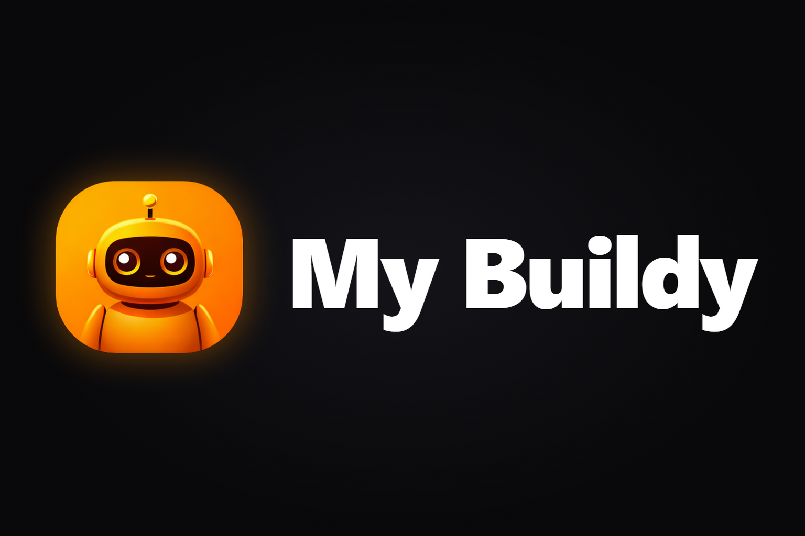
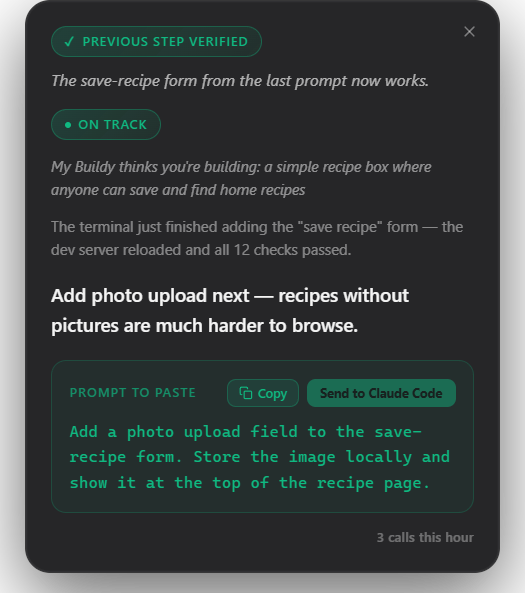
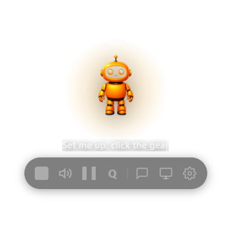
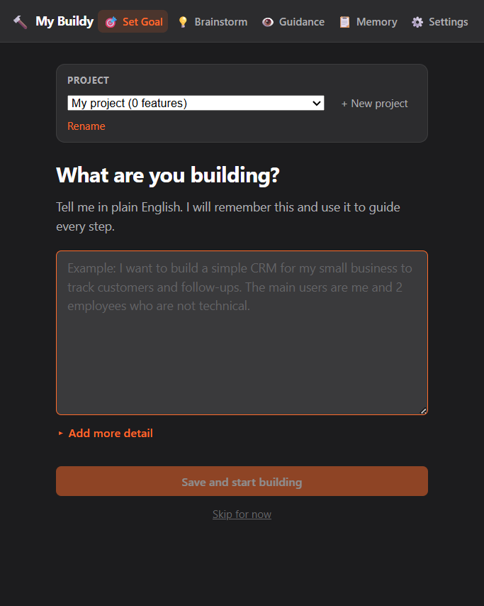
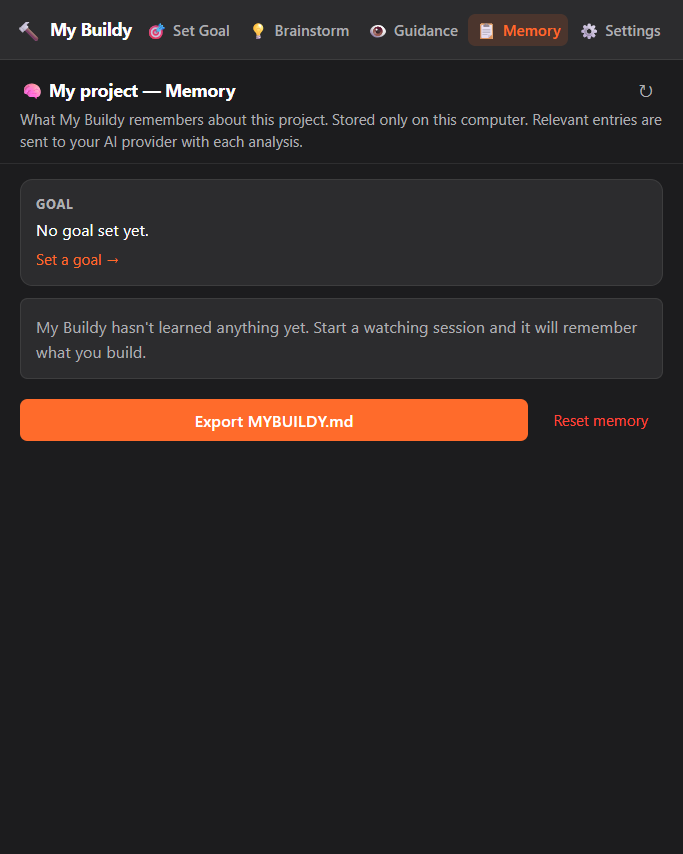
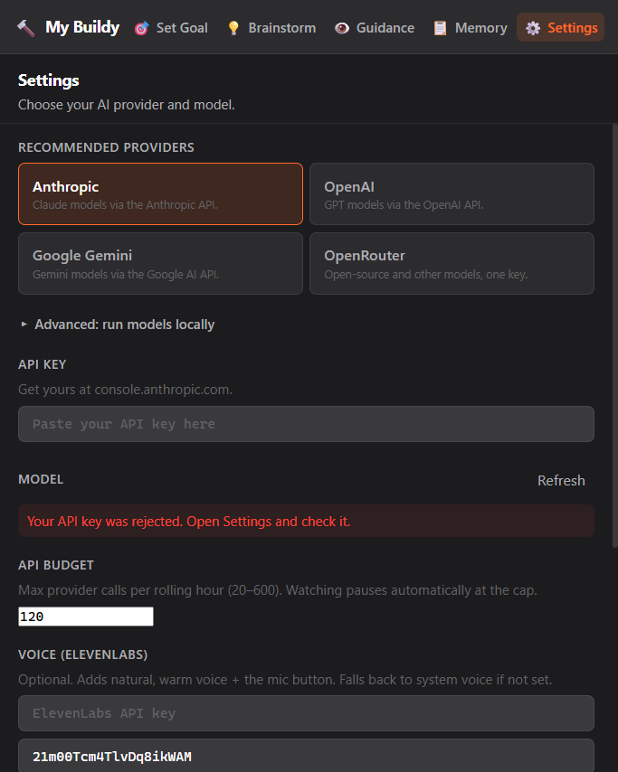

<p align="center">
  
</p>

<p align="center"><strong>Every loop engineering tool assumes you can read code. My Buildy is that loop, for people who can't.</strong></p>

<p align="center">
  
  <a href="./LICENSE"></a>
  <a href="https://github.com/SukinShetty/mybuildy/releases/latest"></a>
  <a href="https://www.electronjs.org/"></a>
</p>

---

## Demo

<!-- DEMO VIDEO: replace this line with the demo video embed/link when it is ready. -->
> **Demo video coming soon.** Until then, the screenshots below show the real app.

<p align="center">
  
</p>

<p align="center">
  <table>
    <tr>
      <td align="center">
        <br/>
        <sub>The mascot watches with you</sub>
      </td>
      <td align="center">
        <br/>
        <sub>Set the goal once</sub>
      </td>
      <td align="center">
        <br/>
        <sub>Per-project memory</sub>
      </td>
      <td align="center">
        <br/>
        <sub>Bring your own provider</sub>
      </td>
    </tr>
  </table>
</p>

---

## What My Buildy does

Claude Code is astonishing — and it was built by developers, for developers. If you can't read code, 400 lines of terminal output fly past and you have no idea whether something brilliant just happened or your project is on fire.

My Buildy is a desktop companion that sits next to your Claude Code terminal and translates:

- **Watches only the window you pick** — one explicit choice, never your whole screen
- **Explains what just happened** in plain English, no jargon
- **Judges every step against your goal** — on track, drifting, or blocked
- **Writes the exact next prompt to paste** — no guessing, no googling
- **Sends it for you when you click approve** — you never have to touch the terminal
- **Verifies whether the last prompt actually worked** before moving on
- **Stops and asks you** when a decision genuinely needs a human
- **Speaks guidance out loud** (optional) so you can stay heads-up
- **Remembers your project across sessions** — decisions, blockers, what's been built

My Buildy runs the loop. You approve each step.

---

## How the loop works

1. **Goal** — you say what you're building once. Every step is judged against it.
2. **Watch** — you pick your Claude Code window. My Buildy captures only that window.
3. **Explain** — a vision model reads the screenshot and tells you, in plain English, what the agent just did. My Buildy detects when the agent's turn ends and analyzes within about 10 seconds of it stopping.
4. **Next prompt** — My Buildy writes the exact prompt that moves your goal forward.
5. **Send when you approve** — one click sends the prompt into the watched window (Windows). Nothing is ever sent without your click.
6. **Verify** — a separate check confirms whether the last prompt achieved its intended outcome before the loop moves on.
7. **Hand-off** — when a decision needs a human (choosing a database, a payment provider, deleting data), My Buildy stops and asks instead of guessing.

---

## Loop engineering

Loop engineering is the pattern of building a system that prompts the AI, checks the result, corrects course, and repeats — instead of typing every prompt yourself. My Buildy has **four of the six loop engineering blocks** built:

| Block | Status | What it does in My Buildy |
|---|---|---|
| **Goal** | ✅ Built | You state the goal once; every analysis reports on track / drifting / blocked against it. |
| **Memory** | ✅ Built | Per-project memory (powered by [Nemp Memory](https://github.com/SukinShetty/Nemp-memory)) persists decisions, blockers, and completed features across sessions — local JSON, namespaced per project. |
| **Verifier** | ✅ Built | A separate AI check confirms whether the prompt you sent actually achieved its intended outcome. |
| **Hand-off** | ✅ Built | Genuine decisions are detected and handed back to you with options, instead of being guessed. |
| **Heartbeat** | 🗺️ Roadmap | Scheduled loop runs without a manual trigger. |
| **MCP connectors** | 🗺️ Roadmap | GitHub, Slack, Linear and friends as loop inputs/outputs. |

---

## Providers

My Buildy brings no model of its own — you connect a provider with your own key. **There is no default model: you choose one in Settings**, from a live model list fetched from your provider.

**Recommended:**

- **Anthropic**
- **OpenAI**
- **Google Gemini**
- **OpenRouter** — one key for many models, including open-source ones

**Advanced: run models locally** — Ollama, LM Studio, or any custom OpenAI-compatible endpoint.

Whatever you pick, the model must **pass the vision check** (My Buildy sends it a tiny test image and asks what color it is) before watching is enabled — analysis is screenshot-based, so a text-only model cannot do the job.

---

## Install

### Windows (installer)

1. Download **`MyBuildy-Setup-0.1.0.exe`** (~110 MB) from the [latest release](https://github.com/SukinShetty/mybuildy/releases/latest).
2. Windows SmartScreen will warn you because the installer is **unsigned** (signing certificates are expensive; a signed installer is on the roadmap). Click **More info**, then **Run anyway**.
3. The release page includes a `SHA256SUMS.txt` if you want to verify the download.

### From source (any OS)

Requires Node.js 18+.

```bash
git clone https://github.com/SukinShetty/mybuildy.git
cd mybuildy

# --legacy-peer-deps is required: npm 10+ crashes with an arborist "edgesOut"
# error on a clean install without it, even though every peer resolves.
npm install --legacy-peer-deps

npm run dev
```

macOS and Linux run from source but are **untested** — see [Known limitations](#known-limitations).

---

## First run

1. My Buildy opens **Settings** on first launch.
2. Pick a provider and paste your API key (it is encrypted on save — see [Security model](#security-model)).
3. Choose a model from the live list. My Buildy runs the **vision check**; watching stays disabled until a model passes it.
4. Optionally add an **ElevenLabs** key for spoken guidance (the mic button only appears once a key is saved).
5. Pick or create a **project** — each project gets its own memory.
6. Set your **goal**, pick the Claude Code window to watch, and start. The first time you pick a window, My Buildy shows a one-time disclosure explaining exactly what gets captured and where it goes.

---

## Cost

My Buildy uses **your** API key, and **each analysis is a paid API call** to your provider. What that means in practice:

- My Buildy is aggressive about not wasting calls: while the agent is working, it takes cheap low-resolution local snapshots (never sent anywhere) and only runs a real analysis when the agent's turn ends.
- There is an **hourly cap** — at most 120 provider calls per rolling hour by default, editable from 20 to 600 in Settings. Watching pauses at the cap.
- To keep costs low: pick a cheaper vision-capable model, lower the cap, pause watching when you step away, or run a local model via Ollama/LM Studio for zero API cost.

---

## Privacy and data

No accounts, no servers, **no telemetry**. Everything lives on your machine; the only network calls are the ones you configure.

| Data | Where it lives | Who it is sent to |
|---|---|---|
| Screenshots of the watched window | Processed in memory, never written to disk | **Your AI provider** (the one you configured), for analysis |
| Project memory (goals, decisions, blockers) | `userData/mybuildy-memory/<projectId>` as plain JSON | Included in analysis context sent to **your AI provider** |
| Spoken guidance text | — | **ElevenLabs**, only if you add an ElevenLabs key; otherwise the system voice is used and nothing is sent |
| API keys | Encrypted at rest in your user-data directory (OS keystore via Electron `safeStorage`) | Only to the provider each key belongs to, from the main process |
| Settings | Plain JSON in your user-data directory (secrets are stripped out) | Nobody |
| Anything else | — | **Nothing else is sent to anyone.** |

**Delete everything:** Settings has a **Delete all My Buildy data** button that removes keys, settings, and every project's memory. Uninstalling and deleting the `MyBuildy` user-data folder does the same.

Screenshots may contain whatever is visible in the watched window — code, secrets, personal data. Watch only the window you intend to share; your provider's data-retention policies apply to what you send.

---

## Security model

- **Encrypted keys** — API keys are stored with Electron `safeStorage` (DPAPI on Windows). If OS encryption is unavailable, My Buildy **refuses to save keys in plaintext**. Keys never cross into the renderer — the UI only ever sees `hasKey: true/false`.
- **Sandboxed renderers** — `contextIsolation: true`, `nodeIntegration: false`; the UI cannot touch Node, the filesystem, or the network directly.
- **Validated IPC** — every IPC channel validates its payload shape in the main process before acting.
- **Strict CSP** and navigation guards — renderer windows cannot load or navigate to remote content.
- **Send safety guard** — prompts about to be sent are scanned for destructive patterns (deletes, force-pushes, secrets exfiltration). Flagged prompts need a second, explicit confirmation click.

One honest caveat: My Buildy reads your screen, and **text on the screen can influence the prompts it suggests** (a form of prompt injection). That is exactly why My Buildy never sends anything on its own — every send needs your click, and the guard adds a second click on anything that looks destructive.

See [SECURITY.md](./SECURITY.md) for the reporting policy.

---

## Codex CLI (experimental)

My Buildy recognizes the agent in the watched window and adapts its labels ("Send to Claude Code" vs "Send to Codex"). **Codex CLI support is experimental** — the loop is built and tested around Claude Code first.

---

## Known limitations

- **Send is Windows-only.** On other platforms you copy the prompt and paste it yourself.
- **macOS and Linux are untested.** They can run from source, but no testing has been done there yet — reports welcome.
- **Window identity edge case:** if the watched window closes and, within ~15 seconds, a brand-new window appears that reuses the same OS window handle, My Buildy can follow the new window. Closing and reopening normally is handled; this narrow reuse window is not.
- **The Send guard is heuristic.** It is a speed bump against destructive prompts, not a guarantee — you remain the final check.
- **The verifier judges from screenshots.** It confirms what is visible on screen, not what happened inside your codebase; it can be wrong when the screen doesn't tell the whole story.

---

## Roadmap

- **Autopilot (v1.1)** — sends prompts automatically while the loop stays on track, within a step budget you set; stops the moment things drift, block, or need a hand-off decision.
- **Heartbeat** — scheduled loop runs without a manual trigger.
- **MCP connectors** — GitHub, Slack, Linear as loop inputs/outputs.
- **macOS installer** and testing.
- **Signed Windows installer** (goodbye SmartScreen warning).

---

## Troubleshooting / FAQ

**`npm install` fails or crashes.**
Use `npm install --legacy-peer-deps` — npm 10+ crashes with an arborist "edgesOut" error on a clean install without the flag.

**Watching won't start / "Choose a model in Settings".**
There is no default model. Open Settings, pick a provider and a model, and let the vision check pass — watching is blocked until it does.

**The vision check fails.**
The model you picked can't read images. Pick a vision-capable model (the model list marks likely candidates), or for local providers make sure the server is running and the model supports images.

**The mascot is silent.**
Voice uses ElevenLabs when a key is saved in Settings, otherwise the system voice. Check that quiet mode is off on the mascot.

**Analysis stopped by itself.**
You likely hit the hourly call cap. Raise it in Settings or wait for the rolling hour to pass.

**Can I run it fully offline?**
Yes — pick Ollama or LM Studio under Advanced, point the Base URL at your local server, choose a vision-capable local model, and skip the ElevenLabs key.

Something else? [Open an issue](https://github.com/SukinShetty/mybuildy/issues).

---

## Contributing

Contributions are welcome — see [CONTRIBUTING.md](./CONTRIBUTING.md). The short version: `npm install --legacy-peer-deps`, keep `npm run build` and `npm test` green, open an issue first for anything bigger than a small fix. [`AGENTS.md`](./AGENTS.md) documents the architecture.

---

## License

[MIT](./LICENSE) © Sukin Shetty

---

<p align="center">Built for non-technical builders who want to ship.<br/>My Buildy runs the loop. You approve each step.</p>
