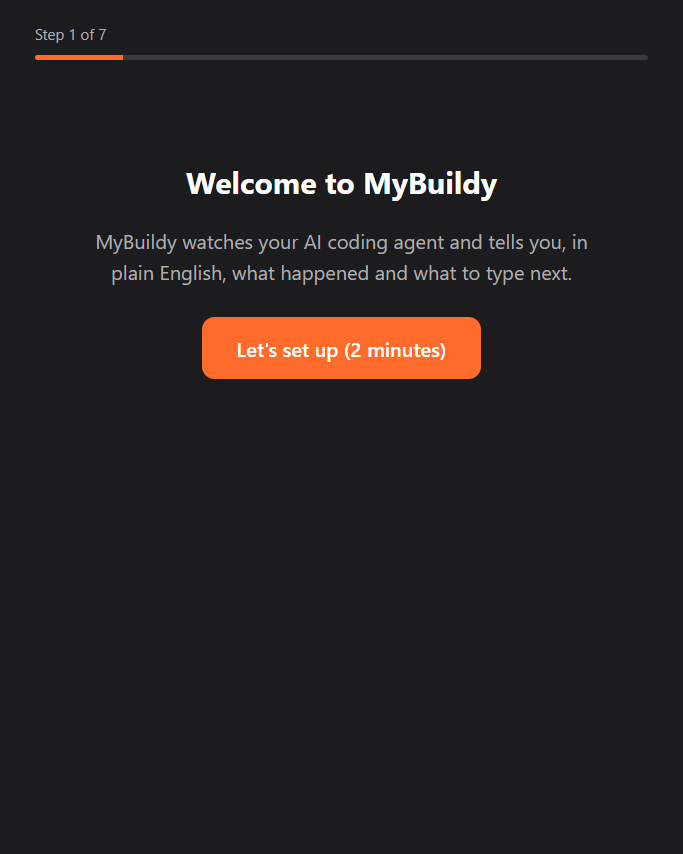

<p align="center">
  
</p>

<p align="center"><strong>Every loop engineering tool assumes you can read code. MyBuildy is that loop, for people who can't.</strong></p>

<p align="center">
  
  <a href="./LICENSE"></a>
  <a href="https://github.com/SukinShetty/mybuildy/releases/latest"></a>
  <a href="https://www.electronjs.org/"></a>
</p>

---

## Demo

<!-- DEMO VIDEO: replace this line with the demo video embed/link when it is ready. -->
> **Demo video coming soon.** Until then, the screenshots below show the real app.

<p align="center">
  
</p>

<p align="center">
  <table>
    <tr>
      <td align="center">
        <br/>
        <sub>The mascot watches with you</sub>
      </td>
      <td align="center">
        <br/>
        <sub>Guided first-run setup</sub>
      </td>
      <td align="center">
        <br/>
        <sub>Set the goal once</sub>
      </td>
      <td align="center">
        <br/>
        <sub>Per-project memory</sub>
      </td>
      <td align="center">
        <br/>
        <sub>Bring your own provider</sub>
      </td>
    </tr>
  </table>
</p>

---

## What MyBuildy does

AI coding agents in the terminal are astonishing — and they were built by developers, for developers. If you can't read code, 400 lines of terminal output fly past and you have no idea whether something brilliant just happened or your project is on fire.

MyBuildy is a companion for any AI coding agent that runs in a terminal window. Built and tested with Claude Code; with other agents watching works and paste is untested — see [Works with your agent](#works-with-your-agent).

MyBuildy is a desktop companion that sits next to your AI coding agent's terminal and translates:

- **Watches only the window you choose** — one explicit choice, never your whole screen
- **Explains what just happened** in plain English, no jargon
- **Judges every step against your goal** — on track, drifting, or blocked
- **Writes the exact next prompt to paste** — no guessing, no googling
- **Pastes it into your terminal when you click** — you read it, then press Enter to run it
- **Verifies whether the last prompt actually worked** before moving on
- **Stops and asks you** when a decision genuinely needs a human
- **Speaks guidance out loud** (optional) so you can stay heads-up
- **Remembers your project across sessions** — decisions, blockers, what's been built

MyBuildy runs the loop. You approve each step.

---

## How the loop works

1. **Goal** — you say what you're building once. Every step is judged against it.
2. **Watch** — you pick the terminal window your agent is running in. MyBuildy captures only that window.
3. **Explain** — a vision model reads the screenshot and tells you, in plain English, what the agent just did. MyBuildy detects when the agent's turn ends and analyzes within about 10 seconds of it stopping.
4. **Next prompt** — MyBuildy writes the exact prompt that moves your goal forward.
5. **Paste when you approve** — one click pastes the prompt into the watched terminal (Windows and macOS). MyBuildy never presses Enter: you read the prompt and run it yourself.
6. **Verify** — a separate check confirms whether the last prompt achieved its intended outcome before the loop moves on.
7. **Hand-off** — when a decision needs a human (choosing a database, a payment provider, deleting data), MyBuildy stops and asks instead of guessing.

---

## Loop engineering

Loop engineering is the pattern of building a system that prompts the AI, checks the result, corrects course, and repeats — instead of typing every prompt yourself. MyBuildy has **four of the six loop engineering blocks** built:

| Block | Status | What it does in MyBuildy |
|---|---|---|
| **Goal** | ✅ Built | You state the goal once; every analysis reports on track / drifting / blocked against it. |
| **Memory** | ✅ Built | Per-project memory (powered by [Nemp Memory](https://github.com/SukinShetty/Nemp-memory)) persists decisions, blockers, and completed features across sessions — local JSON, namespaced per project. What the agent is doing at a given moment (reading, idle, waiting) is never stored. |
| **Verifier** | ✅ Built | A separate AI check confirms whether the prompt you sent actually achieved its intended outcome. |
| **Hand-off** | ✅ Built | Genuine decisions are detected and handed back to you with options, instead of being guessed. |
| **Heartbeat** | 🗺️ Roadmap | Scheduled loop runs without a manual trigger. |
| **MCP connectors** | 🗺️ Roadmap | GitHub, Slack, Linear and friends as loop inputs/outputs. |

---

## Providers

MyBuildy brings no model of its own — you connect a provider with your own key. **There is no default model: you choose one in Settings**, from a live model list fetched from your provider.

**Recommended:**

- **Anthropic**
- **OpenAI**
- **Google Gemini**
- **OpenRouter** — one key for many models, including open-source ones

**Advanced: run models locally** — Ollama, LM Studio, or any custom OpenAI-compatible endpoint.

Whatever you pick, the model must **pass the vision check** (MyBuildy sends it a tiny test image and asks what color it is) before watching is enabled — analysis is screenshot-based, so a text-only model cannot do the job.

---

## Install

### Windows (installer)

1. Download **`MyBuildy-Setup-0.1.0.exe`** (~110 MB) from the [latest release](https://github.com/SukinShetty/mybuildy/releases/latest).
2. Windows SmartScreen will warn you because the installer is **unsigned** (signing certificates are expensive; a signed installer is on the roadmap). Click **More info**, then **Run anyway**.
3. The release page includes a `SHA256SUMS.txt` if you want to verify the download.

### macOS (DMG)

1. Download the DMG for your Mac from the [latest release](https://github.com/SukinShetty/mybuildy/releases/latest): **`MyBuildy-0.1.0-arm64.dmg`** for Apple Silicon (M1 and later) or **`MyBuildy-0.1.0-x64.dmg`** for Intel. Not sure? Apple menu > About This Mac: "Chip: Apple M…" means arm64.
2. Open the DMG and drag **MyBuildy** into **Applications**.
3. The app is ad-hoc signed but **not notarized** (that needs a paid Apple Developer account), so macOS blocks the first launch. On **macOS 15 Sequoia and later**:
   1. Double-click **MyBuildy** in Applications. macOS says it was **"Not Opened"** — click **Done** (not Move to Trash).
   2. Open **System Settings → Privacy & Security** and scroll to the bottom. Next to **"MyBuildy was blocked to protect your Mac"**, click **Open Anyway**.
   3. Enter your password, then click **Open Anyway** again. Do this within about an hour of step 1, or the button disappears and you start again.

   On **macOS 14 Sonoma**, right-click (or Control-click) **MyBuildy** in Applications, choose **Open**, then **Open** again. Either way you only need to do this once.
4. If macOS instead says **"MyBuildy is damaged and can't be opened"**, that is the download quarantine flag on an un-notarized app, not real damage. Run this once in Terminal, then open the app again:

   ```bash
   xattr -dr com.apple.quarantine /Applications/MyBuildy.app
   ```

5. macOS asks for three privacy permissions. MyBuildy checks each one, tells you exactly what to turn on, and has a button that opens the right System Settings pane:
   - **Screen Recording** (called **Screen & System Audio Recording** on newer macOS) — required to watch a window. **macOS only applies it after you quit and reopen MyBuildy.**
   - **Accessibility** and **Automation → System Events** — needed only for **Paste into terminal** (pressing Cmd+V in your terminal). Without them, the prompt stays on your clipboard to paste yourself.

**After installing a new version:** because the app is ad-hoc signed (no Apple Developer identity), macOS treats every new build as a different app and forgets its permissions — System Settings may still show the switch **on** while MyBuildy says it is missing. Fix it once per update: in that System Settings list select MyBuildy, click **−** to remove it, then turn it back on (or re-add it with **+**). The Keychain may also ask again — choose **Always Allow**.

`SHA256SUMS.txt` covers the DMGs too. Testing a Mac build? Follow [docs/MAC-TESTING.md](./docs/MAC-TESTING.md).

### From source (any OS)

Requires Node.js 22.12 or newer.

```bash
git clone https://github.com/SukinShetty/mybuildy.git
cd mybuildy

# --legacy-peer-deps is required: npm 10+ crashes with an arborist "edgesOut"
# error on a clean install without it, even though every peer resolves.
npm install --legacy-peer-deps

npm run dev
```

Linux runs from source but is **untested** — see [Known limitations](#known-limitations).

---

## First run

MyBuildy opens a **guided setup** on first launch — one step per screen, about two minutes:

1. **Your AI key** — pick a provider and paste your key (each has a *Where do I get a key?* link). It is encrypted on save — see [Security model](#security-model).
2. **Your model** — the **Suggested** one is highlighted and checked automatically; watching stays off until a model passes the **vision check**.
3. **macOS only: see your screen** — one click opens the right System Settings pane; the status turns green by itself, and **Restart MyBuildy** reopens the app on the same step when macOS needs a restart.
4. **macOS only: paste for you** (optional) — both macOS prompts appear here, explained, instead of by surprise later. **Skip — I'll paste myself** keeps pasting copy-only.
5. **What do you want to build?** — tap one of four ready-made goals (each with a "Done when…" check) or write your own.
6. **Open your coding agent** — the exact commands to type, with Copy buttons.
7. **Show MyBuildy your coding agent** — choose the terminal window; this step explains exactly what gets captured and where it goes.

Afterwards the line under the robot always says the next thing to do. The robot's bar can **Hide** it while it keeps watching (bring it back from the tray icon or **Ctrl+Shift+B**, **Cmd+Shift+B** on Mac) or **Quit** MyBuildy; Settings → **Robot size** makes it bigger or smaller (or hold Ctrl/Cmd and scroll over the robot). Settings has **Run setup again**. Optional: add an **ElevenLabs** key in Settings for spoken guidance (the mic button only appears once a key is saved, and the microphone is only requested the first time you click it).

---

## Cost

MyBuildy uses **your** API key, and **each analysis is a paid API call** to your provider. What that means in practice:

- MyBuildy is aggressive about not wasting calls: while the agent is working, it takes cheap low-resolution local snapshots (never sent anywhere) and only runs a real analysis when the agent's turn ends.
- There is an **hourly cap** — at most 120 provider calls per rolling hour by default, editable from 20 to 600 in Settings. Watching pauses at the cap.
- To keep costs low: pick a cheaper vision-capable model, lower the cap, pause watching when you step away, or run a local model via Ollama/LM Studio for zero API cost.

---

## Privacy and data

No accounts, no MyBuildy servers, **no telemetry**. Your settings, keys and project memory live on this computer. This is everything MyBuildy sends, and where:

| Flow | What is sent | Sent to |
|---|---|---|
| **Screen analysis** (watching, and Analyze on the Guidance screen) | An image of the window you chose, its title, your goal and this project's memory | **Your AI provider** |
| **Brainstorm** | Your messages and the conversation so far | **Your AI provider** |
| **Spoken questions** (mic button) | Your recording | **ElevenLabs** speech-to-text |
| | The transcript, plus a fresh screenshot of the watched window and the project context | **Your AI provider** |
| **Spoken guidance** | The text being read aloud | **ElevenLabs**, only if you saved an ElevenLabs key (otherwise your computer's own voice is used and nothing is sent) |
| **Grading and verification** (checking a suggested prompt; checking that a pasted prompt worked) | The prompt, its expected outcome and context | **Your AI provider** — on Anthropic this is a separate call to a small Claude Haiku model |
| **Connection and model setup** (model list, vision check) | Requests carrying your API key; the vision check also sends a tiny test image | **Your AI provider** |

With Ollama, LM Studio or a custom endpoint on this computer, "your AI provider" is on this computer too. A custom endpoint elsewhere receives what the table says your AI provider receives. Each API key is only ever sent to its own provider's address, and a custom endpoint's key only to the endpoint it was entered for.

Nothing else is sent: MyBuildy makes no other network requests (no analytics, no update checks).

| Stored on this computer | Where |
|---|---|
| API keys | Encrypted with your operating system's keystore (Electron `safeStorage`); plain-text storage is refused |
| Project memory (goals, decisions, blockers) | `userData/mybuildy-memory/<projectId>` as plain JSON |
| Settings | Plain JSON in the user-data folder, with keys stripped out |
| Screenshots | Never written to disk — processed in memory only |
| Diagnostic log (when watching starts, pauses or stops, and why; paste outcomes) | `userData/logs/watch.log`, no window titles or screen text. Settings → **Open log folder** |

**Delete everything:** Settings has a **Delete all MyBuildy data** button that removes keys, settings, every project's memory and the diagnostic log. Uninstalling and deleting the `MyBuildy` user-data folder does the same.

Screenshots may contain whatever is visible in the watched window — code, secrets, personal data. Watch only the window you intend to share; your provider's data-retention policies apply to what you send.

---

## Security model

- **Encrypted keys** — API keys are stored with Electron `safeStorage` (DPAPI on Windows, the Keychain on macOS). If OS encryption is unavailable, MyBuildy **refuses to save keys in plaintext**. A key you type passes from the Settings screen to the main process once and is then stored encrypted; saved keys are never sent back to the interface, which only ever sees whether a key is set.
- **Sandboxed renderers** — `contextIsolation: true`, `nodeIntegration: false`; the UI cannot touch Node, the filesystem, or the network directly.
- **Validated IPC** — every IPC channel validates its payload shape in the main process before acting.
- **Strict CSP** and navigation guards — renderer windows cannot load or navigate to remote content.
- **Paste safety guard** — prompts about to be pasted are scanned for destructive patterns (deletes, disk formatting, force-pushes, secrets exfiltration). Flagged prompts need a second, explicit click. MyBuildy never presses Enter, so nothing runs until you do.

One honest caveat: MyBuildy reads your screen, and **text on the screen can influence the prompts it suggests** (a form of prompt injection). That is exactly why MyBuildy never pastes on its own and never presses Enter — every paste needs your click, the guard adds a second click on anything that looks destructive, and you run the prompt yourself.

See [SECURITY.md](./SECURITY.md) for the reporting policy.

---

## Works with your agent

MyBuildy watches pixels, not an API — so **watching, explaining, the verifier and hand-off work with any coding agent that runs in a terminal window**. It detects which agent it is looking at and adapts its guidance; the button always reads **Paste into terminal**.

Only **Paste into terminal** depends on how the agent's terminal accepts a pasted prompt, and that is where testing so far is uneven:

| Agent | Status |
|---|---|
| **Claude Code** | Built and tested with this. |
| **Codex CLI** | Recognised; watching works. Paste is untested. Copy and paste always works. |
| **Any other terminal agent** (Gemini CLI, Cursor CLI, Aider, and so on) | Watching and explaining work. Paste is untested. Copy and paste always works. |

Tried MyBuildy with another agent? Please [open an issue](https://github.com/SukinShetty/mybuildy/issues) with what worked and what didn't — this table will be updated as results come in.

---

## Known limitations

- **Paste into terminal works on Windows and macOS.** On Linux you copy the prompt and paste it yourself. It never presses Enter.
- **macOS is new in this release.** It is built, type-checked and unit-tested on macOS in CI, and the in-app permission checks explain every macOS prompt — but first hands-on testing on a real Mac is still under way ([docs/MAC-TESTING.md](./docs/MAC-TESTING.md)). Reports welcome.
- **macOS paste targets the watched app, then its window by title.** If the app (say Terminal) has several windows open, macOS brings the app forward and MyBuildy raises the watched window by its exact title; if the title changed that instant, another window of the same app could receive the paste. MyBuildy checks the right *app* is in front before typing, but it cannot prove which of its windows is.
- **The macOS app is not notarized** — the first launch needs a one-time **Open Anyway** in System Settings (right-click > Open on macOS 14; see [Install](#macos-dmg)).
- **Linux is untested.** It can run from source, but no testing has been done there yet.
- **Window identity edge case:** if the watched window closes and, within ~15 seconds, a brand-new window appears that reuses the same OS window handle, MyBuildy can follow the new window. Closing and reopening normally is handled; this narrow reuse window is not.
- **The paste guard is heuristic.** It is a speed bump against destructive prompts, not a guarantee — you remain the final check.
- **The verifier judges from screenshots.** It confirms what is visible on screen, not what happened inside your codebase; it can be wrong when the screen doesn't tell the whole story.

---

## Roadmap

- **Autopilot (v1.1)** — sends prompts automatically while the loop stays on track, within a step budget you set; stops the moment things drift, block, or need a hand-off decision.
- **Heartbeat** — scheduled loop runs without a manual trigger.
- **MCP connectors** — GitHub, Slack, Linear as loop inputs/outputs.
- **Notarized macOS build** (no Open Anyway step).
- **Signed Windows installer** (goodbye SmartScreen warning).

---

## Troubleshooting / FAQ

**`npm install` fails or crashes.**
Use `npm install --legacy-peer-deps` — npm 10+ crashes with an arborist "edgesOut" error on a clean install without the flag.

**Watching won't start / "Choose a model in Settings".**
There is no default model. Open Settings, pick a provider and a model, and let the vision check pass — watching is blocked until it does.

**The vision check fails.**
The model you picked can't read images. Pick a vision-capable model (the model list marks likely candidates), or for local providers make sure the server is running and the model supports images.

**The mascot is silent.**
Voice uses ElevenLabs when a key is saved in Settings, otherwise the system voice. Check that quiet mode is off on the mascot.

**Analysis stopped by itself.**
You likely hit the hourly call cap. Raise it in Settings or wait for the rolling hour to pass.

**macOS: watching won't start and it asks for Screen Recording.**
Turn MyBuildy on in System Settings > Privacy & Security > Screen Recording (**Screen & System Audio Recording** on newer macOS), then **quit and reopen MyBuildy** — macOS ignores the permission until the app restarts.

**macOS: Paste into terminal pastes nothing.**
Pasting needs Accessibility and Automation → System Events for MyBuildy (System Settings > Privacy & Security). The panel tells you which one is missing and opens it; the prompt stays on your clipboard meanwhile.

**Can I run it fully offline?**
Yes — pick Ollama or LM Studio under Advanced, point the Base URL at your local server, choose a vision-capable local model, and skip the ElevenLabs key.

Something else? [Open an issue](https://github.com/SukinShetty/mybuildy/issues).

---

## Contributing

Contributions are welcome — see [CONTRIBUTING.md](./CONTRIBUTING.md). The short version: `npm install --legacy-peer-deps`, keep `npm run build` and `npm test` green, open an issue first for anything bigger than a small fix. [`AGENTS.md`](./AGENTS.md) documents the architecture.

---

## Licence

MyBuildy is source-available under the [PolyForm Shield License 1.0.0](./LICENSE). Anyone can use it for free, including for their own work and business. You may not sell MyBuildy, or use its code to build a product that competes with it. Versions published before 25 September 2026 were released under the MIT licence.

---

<p align="center">Built for non-technical builders who want to ship.<br/>MyBuildy runs the loop. You approve each step.</p>
